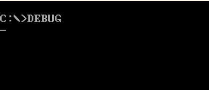
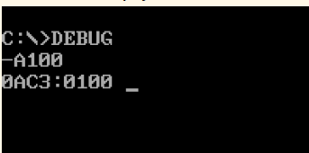
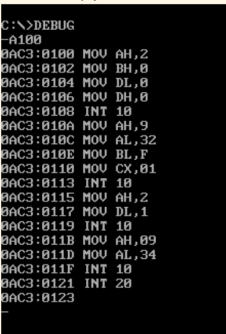
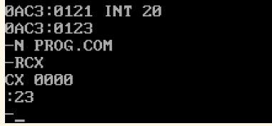
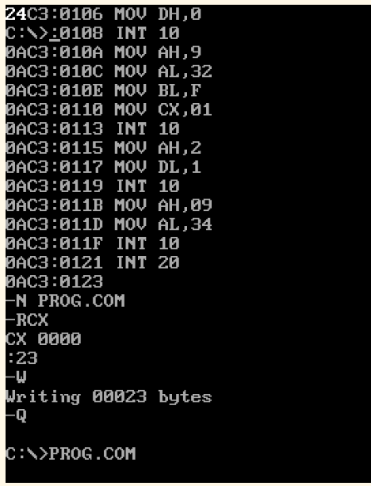

# Comandos para criar um novo arquivo

Primeiro acessamos a área de `debug` usando a propria palavra `debug`.

Perfeito, o ambiente `debug` é bem facil de saber se está ou não graças ao traço que fica na direita.

Agora dentro do ambiente `debug` vamos digitar o comando `A100` isso faz com que eu ative inserção de código em **assembly** a partid a posição de memoria 100

Aogra que é ir escrevendo o código sem medo de ser feliz, após îsso você **DEVE** colocar o comando `INT 20` como ultima linha do seu programa, feito isso basta dar dois espaços para fechar o ambiente de inserção em assembly que todo o seu código já estará na posição de memoria 100 até a ultima (que seria a que tem o `INT 20`)

Perceba agora que ao sair eu volto para o ambiente `debug`, isso será importante pois agora iremos dar **nome** e definir o **tamanho** do nosso programa.

Para dar o nome basta usar o comando `N` seguido com o nome que vc quer dar, lembre-se que o nome não pode ser grande e que ele **DEVE** ter o `.com` no final

Por fim para informar o tamanho do programa digite `RCX` e informe o valor da ultima linha de comando **após** o comando `INT 20` subtraindo 100 (lembre-se que a base é hexadecimal), no caso do nosso exemplo seria *123 - 100 = 23*, portanto devo digitar 23 após o comando `RCX`

Agora o passo final!!
Dentro do ambiente `debug` digite `W`, fazendo isso vc está "escrevendo e salvando" o seu arquivo, para conferir se está tudo certo basta sair do ambiente `debug` digitando `Q` e digitando o nome do arquivo ele será executado 

Perceba que eu salvei o arquivo, sai e rodei, o arquivo em questão imprive o número 24 na posição [0,0] da tela